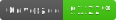
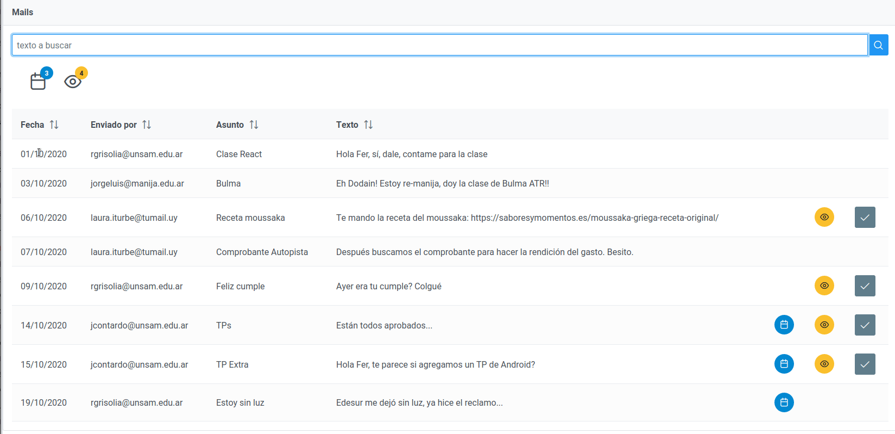
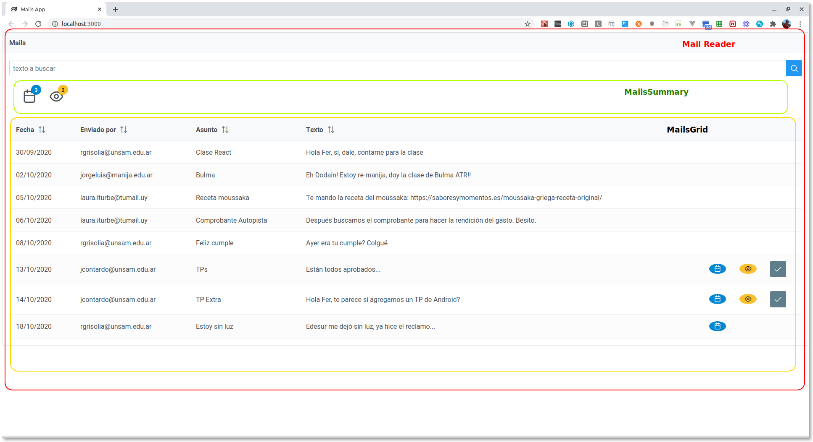

# Ejemplo de Mails

[](https://github.com/uqbar-project/eg-mails-react/actions/workflows/build.yml) 



En este ejemplo podemos ver

- el uso de React Hooks (`useState` y `useEffect`) para manipular el estado en un componente funcional cuando tenemos que disparar llamadas asincrónicas
- cómo podemos pasar una función desde un componente padre a uno hijo para disparar actualizaciones en cascada
- el renderizado condicional de componentes, recordando que JSX son expresiones (javascript)

## Componentes React

La aplicación cuenta con tres componentes React desarrollados por nosotros:

- **MailReader**: el componente "madre" (o padre) que permite ingresar un texto de búsqueda
- **MailsSummary**: el que nos permite detectar cuántos mails sin leer y cuántos mails recientes tenemos en base a los filtros seleccionados
- **MailsGrid**: el componente que muestra la lista de mails, permite ordenarlos y marcar como leídos aquellos que están sin leer.



## MailReader

MailReader tiene como estado:

- el texto de búsqueda
- y los mails

### useState

Para mantener la idea del componente como función, utilizamos el hook `useState`:

```js
export const MailReader = () => {
  const [textoBusqueda, setTextoBusqueda] = useState('')
  const [mails, setMails] = useState([])
```

## Buscando mails

Para buscar mails utilizamos una función asincrónica que recibe el nuevo texto de búsqueda y

- actualiza el texto de búsqueda (para que se vea en el input)
- dispara la búsqueda de mails
- y ubica el resultado de esa búsqueda en el estado para actualizar la lista de mails

En la nueva variante **no usamos el hook useEffect** y como conclusión es bastante simple de entender. Si querés ver cómo es la implementación con useEffect podés leer [esta página](./useEffect.md).

## MailsSummary

El resumen de los mails leídos y recientes aparece con dos íconos con sus respectivos _badges_. Recibimos la lista de mails y filtramos las cantidades correspondientes:

```js
export const MailsSummary = ({ mails }) => {
  const cantidadRecientes = mails.filter((mail) => mail.esReciente()).length
  const cantidadSinLeer = mails.filter((mail) => !mail.leido).length
  ... armamos los badges ...
```

Para calcular las cantidades, recibimos como _props_ únicamente los mails, por eso utilizamos la sintaxis de deconstrucción de objetos:

```js
const ave = { nombre: 'pepita', edad: 20 }
ave.nombre   // 'pepita'
ave.edad     // 20
// o... equivalente
const { nombre, edad } = { nombre: 'pepita', edad: 20 } // o una referencia
nombre   // 'pepita'
edad     // 20
```

## MailsGrid

Este componente funcional muestra la lista de mails con un DataTable:

```js
export const MailsGrid = ({ mails, alLeerMail }) => {
  return (
    <DataTable value={mails} autoLayout={true} className="p-datatable-striped">
      <Column header="Fecha" body={fechaTemplate} field="fechaOrdenamiento" sortable></Column>
      <Column field="emisor" header="Enviado por" sortable></Column>
      <Column field="asunto" header="Asunto" sortable></Column>
      <Column field="texto" header="Texto" sortable></Column>
      <Column body={recienteTemplate} ></Column>
      <Column body={leidoTemplate} ></Column>
      <Column body={marcarComoLeidoTemplate(alLeerMail)} ></Column>
    </DataTable >
  )
}
```

Lo interesante son algunas customizaciones que hicimos:

- en cada `Column` del `DataTable` solo podemos utilizar valores primitivos (no están permitidos objetos), por eso debemos para la fecha generamos una función `fechaTemplate` que le dice qué expresión JSX renderizar:

```js
const fechaTemplate = (mail) => {
  return (
    <span data-testid="fecha">{mail.fechaCorta}</span>
  )
}
```

"fechaCorta" es un método de negocio que formatea la fecha del string a `dd/MM/yyyy`. 

- Por otra parte, le asociamos como field `fechaOrdenamiento` 

```js
  <Column header="Fecha" body={fechaTemplate} field="fechaOrdenamiento" sortable></Column>
```

para que no ordene primero por el día, sino primero por el año, luego por el mes y por último por el día (el formateo es `yyyyMMdd`)

### Renderizado condicional

Para mostrar el ícono de reciente usamos una función que va a recibir el mail y mostrará condicionalmente la expresión JSX que muestra el ícono, o un espacio en blanco:

```jsx
const recienteTemplate = (mail) => {
  return (
    mail.esReciente() ?
      // si el mail es reciente devuelvo el span
      <span title="Reciente" ...>
        <i className="pi pi-calendar"></i>
      </span> 
      :
      // en caso contrario, no muestro nada
      ''
  )
}
```

Lo mismo para el caso del elemento leído. 

### Intro a aplicación parcial

Antes de ver cómo marcamos un mail como leído, vamos a contar una característica de los lenguajes funcionales, que es la aplicación parcial.

Supongamos que tenemos una función que sabe sumar dos números:

```js
const suma = (a, b) => a + b
```

Nada extraño, podemos invocarla:

```js
suma(1, 2)
```

y eso nos da 3. ¿Podemos enviarle menos parámetros que los que espera la función? Sí, pero eso rompe el resultado

```js
suma(1) = (1, undefined) => 1 + undefined => NaN
```

Ahora, si definimos la función de esta manera:

```js
const suma2 = (a) => (b) => a + b
```

Si la invocamos con todos los parámetros, sigue sumando ambos valores:

```js
suma2(1)(2) => (a = 1) => (b = 2) => 1 + 2 => 3
```

Pero si no pasamos todos los parámetros, obtenemos una **nueva función**:

```js
suma2(1) => (a = 1) => b => 1 + b
```

Lo que obtenemos es una función, que dado un número te devuelve el siguiente. Esto es útil si queremos usarlo en el contexto de un map, por ejemplo:

```js
[1, 2, 3, 4, 5].map(suma2(1))
// devuelve [2, 3, 4, 5, 6]
```

Lo importante es entender que cuando definimos una función de muchos parámetros como sucesivas funciones que reciben parámetros de a uno, tenemos un poder mucho mayor, el poder de generar nuevas funciones al pasarle menos parámetros. Es lo que en la programación funcional se denomina **aplicación parcial** (porque la aplicación total es la que involucra a todos los parámetros posibles).

En particular, recuerden para su cursada de Paradigmas de Programación, que

```js
// función sin currificar, al estilo C
// no admite aplicación parcial
const suma = (a, b) => a + b

// función currificada
// admite aplicación parcial
const suma = (a) => (b) => a + b
```

Ahora sí, vamos a verlo en acción para entender cómo marcamos un mail como leído.

### Marcando un mail como leído

El componente hijo `MailsGrid` es el que tiene el botón para marcar como leído un mail. El tema es que recibe los mails como `props`, porque el que maneja el estado es el componente padre: `MailReader`. Entonces, ¿cómo podemos lograr que al presionar el botón haga un cambio de estado?

Para ello, el MailReader le pasa una función en las props, que le dice qué hacer cuando marquen un mail como leído:

```jsx
<MailsGrid mails={mails} alLeerMail={leerMail} />
```

En la definición de MailsGrid (componente hijo) recibimos como props la función asincrónica `alLeerMail`:

```jsx
<Column body={marcarComoLeidoTemplate(alLeerMail)} ></Column>
```

Esa función se la pasamos a su vez a marcarComoLeidoTemplate, que es una función que genera el JSX con el botón:

```jsx
const marcarComoLeidoTemplate = (alLeerMail) => (mail) => {
  return (
    mail.leido ? '' : <Button type="button" data-testid={'btnMarcarLeido' + mail.id} icon="pi pi-check" className="p-button-secondary" title="Marcar como leído" onClick={() => alLeerMail(mail)}></Button>
  )
}
```

Bueno, se picó un poco, ¿no? La función marcarComoLeidoTemplate recibe como parámetro una función (la que dice lo que hay que hacer cuando el usuario presione el botón). A su vez, devuelve... otra función!!


Y la función que devuelve es la que espera `Column`, que dado un mail hace aparecer condicionalmente el botón si el mail no fue leído aun.

Cuando el usuario presiona el botón, se invoca a la función `alLeerMail(mail)`, que termina resolviendo lo que MailReader pidió:

```js
const leerMail = async (mail) => {
  mail.leer()
  await mailService.actualizar(mail)
  setMails([...mails])
```

- marcamos el mail como leído
- actualizamos el "backend" representado por el service, en forma asincrónica
- y por último forzamos un cambio de estado con una copia de los mails (recordemos que tenemos que mutar el objeto que forma parte del estado), para hacer que el MailReader se vuelva a renderizar, y esto causa a su vez el renderizado en cascada de MailsGrid y MailsSummary.

Sí, es fácil perderse. Para los próximos ejemplos veremos alternativas a esta opción. 

## Testeo unitario avanzado

Dejamos aquí la variante para testear la búsqueda del MailReader, que requiere hacer un findAll* asincrónico para esperar a que todos los componentes hijos se rendericen (recomendamos darle una leída a [este material sobre React Testing Library](https://kentcdodds.com/blog/common-mistakes-with-react-testing-library)):

```js
describe('tests del Mail Reader', () => {

  test('al buscar pasa los mails filtrados a los componentes hijos', async () => {
    const { getByTestId } = render(<MailReader />)
    const textSearch = getByTestId('textSearch')
    userEvent.type(textSearch, 'luz')
    const spanMail = await screen.findAllByTestId('fecha')
    expect(spanMail.length).toBe(1)
  })
})
```

## Material relacionado

- [How the useEffect Hook Works (with Examples)](https://daveceddia.com/useeffect-hook-examples/)
- [How Are Function Components Different from Classes?](https://overreacted.io/how-are-function-components-different-from-classes/)
