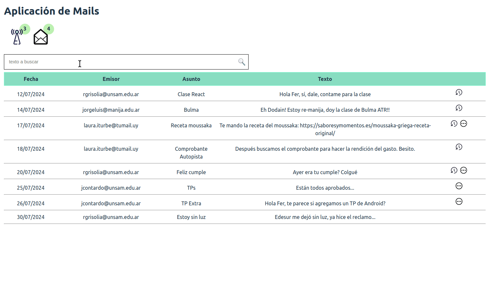

# Ejemplo de Mails

[](https://github.com/uqbar-project/eg-mails-react/actions/workflows/build.yml) [](https://codecov.io/gh/uqbar-project/eg-mails-react)



En este ejemplo podemos ver

- el uso de React Hooks (`useState` y `useOnInit`) para manipular el estado en un componente funcional cuando tenemos que disparar llamadas asincrónicas
- cómo podemos pasar una función desde un componente padre a uno hijo para disparar actualizaciones en cascada
- el renderizado condicional de componentes, recordando que TSX son expresiones (typescript)

## Componentes React

La aplicación cuenta con tres componentes React desarrollados por nosotros:

- **MailReader**: el componente "madre" (o padre) que permite ingresar un texto de búsqueda
- **MailsSummary**: el que nos permite detectar cuántos mails sin leer y cuántos mails recientes tenemos en base a los filtros seleccionados
- **MailsGrid**: el componente que muestra la lista de mails, permite ordenarlos y marcar como leídos aquellos que están sin leer.

## MailReader

MailReader tiene como estado:

- el texto de búsqueda
- y los mails

### useState

Para mantener la idea del componente como función, utilizamos el hook `useState`:

```tsx
export const MailReader = () => {
  const [textoBusqueda, setTextoBusqueda] = useState('')
  const [mails, setMails] = useState([])
```

## Buscando mails

Para buscar mails utilizamos una función asincrónica que recibe el nuevo texto de búsqueda y

- actualiza el texto de búsqueda (para que se vea en el input)
- dispara la búsqueda de mails
- y ubica el resultado de esa búsqueda en el estado para actualizar la lista de mails

En la variante por defecto **no usamos el hook useEffect** y como conclusión es bastante simple de entender. Si querés ver cómo es la implementación con useEffect podés leer [esta página](./useEffect.md). Dado que inicialmente queremos mostrar la lista de mails sin explícitamente hacer una búsqueda, te dejamos el custom hook **useOnInit**, que se define para disparar cambios de estado en la inicialización de nuestro componente. Luego hacemos que el texto de búsqueda dispare los cambios de estado conforme el usuario escriba caracteres.

## MailsSummary

El resumen de los mails leídos y recientes aparece con dos íconos con sus respectivos _badges_. Recibimos la lista de mails y filtramos las cantidades correspondientes:

```tsx
export const MailsSummary = ({ mails }: { mails: Mail[]}) => {
  const cantidadRecientes = mails.filter((mail) => mail.esReciente()).length
  const cantidadSinLeer = mails.filter((mail) => !mail.leido).length
  ... armamos los badges ...
```

Para calcular las cantidades, recibimos como _props_ únicamente los mails, por eso utilizamos la sintaxis de deconstrucción de objetos:

```js
const ave = { nombre: 'pepita', edad: 20 }
ave.nombre   // 'pepita'
ave.edad     // 20
// o... equivalente
const { nombre, edad } = { nombre: 'pepita', edad: 20 } // o una referencia
nombre   // 'pepita'
edad     // 20
```

## MailsGrid

Este componente funcional muestra la lista de mails con un DataTable:

```tsx
export const MailsGrid = ({ mails, alLeerMail }: { mails: Mail[], alLeerMail: (mail: Mail) => void}) => {
  return (
    <div className="grid">
      <div className="table header">
        ... headers ...
      </div>
      { mails.map((mail: Mail) => (
      <div key={'padre' + mail.id}>
        <div key={mail.id} className="table">
          <span data-testid="fecha">{mail.fechaCorta}</span>
          <span>{mail.emisor}</span>
          <span>{mail.asunto}</span>
          <span>{mail.texto}</span>
          <div className="status">
            {mail.esReciente() && </img>}
            {!mail.leido &&  podés hacer click para marcarlo como leído" src="src/assets/pending.svg" data-testid={'no-leido-' + mail.id} onClick={() => alLeerMail(mail)}></img>}
          </div>
        </div>
        <hr/>
      </div>
      )) 
      }
    </div>
  )
}
```

Lo interesante son algunas customizaciones que hicimos:

- delegamos en el mail la responsabilidad de mostrar su fecha "corta" (con formato `dd/MM/yyyy`). Ésto puede resultar controversial, pero recordemos que el mail es nuestro modelo dentro del frontend, podemos pensar entonces que es un modelo que nos sirve para modelar la vista.
- para mostrar el ícono de reciente utilizamos un renderizado condicional...
- ...al igual que para mostrar si el mail fue leído, donde además permitimos que en el caso de hacer click disparemos un cambio de estado a partir de la función que nos pasa **el componente padre**.

Cuando el usuario presiona el botón, se invoca a la función `alLeerMail(mail)`, que termina resolviendo lo que MailReader pidió:

```ts
const leerMail = async (mail: Mail) => {
  mail.leer()
  await mailService.actualizar(mail)
  setMails([...mails])
```

- marcamos el mail como leído
- actualizamos el "backend" representado por el service, en forma asincrónica
- y por último forzamos un cambio de estado con una copia de los mails (recordemos que tenemos que mutar el objeto que forma parte del estado), para hacer que el MailReader se vuelva a renderizar, y esto causa a su vez el renderizado en cascada de MailsGrid y MailsSummary.

Sí, es fácil perderse. Para los próximos ejemplos veremos alternativas a esta opción. 

## Testeo unitario avanzado

Dejamos aquí la variante para testear la búsqueda del MailReader, que requiere hacer un findAll asincrónico para esperar a que todos los componentes hijos se rendericen (recomendamos darle una leída a [este material sobre React Testing Library](https://kentcdodds.com/blog/common-mistakes-with-react-testing-library)):

```js
describe('tests del Mail Reader', () => {

  test('al buscar pasa los mails filtrados a los componentes hijos', async () => {
    const { getByTestId } = render(<MailReader />)
    const textSearch = getByTestId('textSearch')
    userEvent.type(textSearch, 'luz')
    const spanMail = await screen.findAllByTestId('fecha')
    expect(spanMail.length).toBe(1)
  })
})
```
