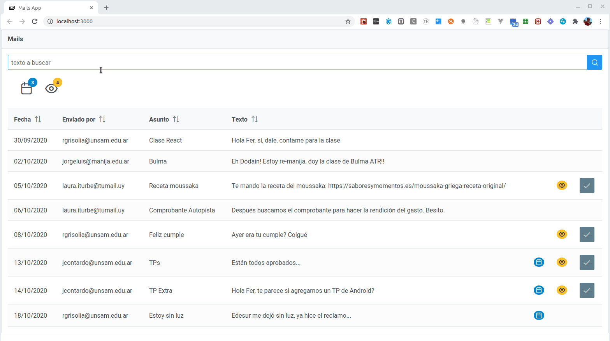

# Ejemplo de Mails

En este ejemplo podemos ver

- el uso de React Hooks (`useState` y `useEffect`) para manipular el estado en un componente funcional cuando tenemos que disparar llamadas asincrónicas
- cómo podemos pasar una función desde un componente padre a uno hijo para disparar actualizaciones en cascada
- el renderizado condicional de componentes, recordando que JSX son expresiones (javascript)

## Material relacionado

- [How the useEffect Hook Works (with Examples)](https://daveceddia.com/useeffect-hook-examples/)
- [How Are Function Components Different from Classes?](https://overreacted.io/how-are-function-components-different-from-classes/)
